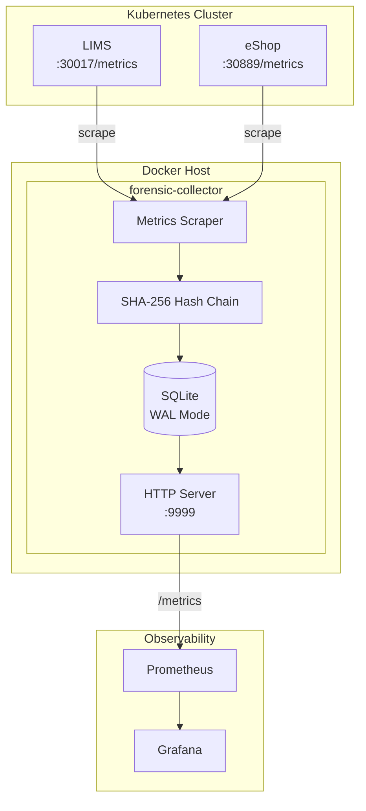

# Forensic Evidence Collector

Blockchain-style tamper-evident audit trail system for compliance monitoring. Scrapes metrics from distributed applications, creates cryptographically-linked evidence blocks, and exposes Prometheus metrics for observability.

[](https://python.org/)
[](https://docker.com/)
[](https://prometheus.io/)

**Live:** [dashboards.jagdevops.co.za](https://dashboards.jagdevops.co.za)

---

## Production Stats

| Metric | Value |
|--------|-------|
| **Evidence Blocks** | 8,544+ |
| **LIMS Samples Tracked** | 11,637 |
| **eShop Transactions** | 4,403 |
| **Chain Integrity** | 100% |
| **Database Size** | 1 GB |
| **Scrape Interval** | 30s |

---

## Architecture


```mermaid
flowchart TB
    subgraph K8s["Kubernetes Cluster"]
        LIMS["LIMS<br/>:30017/metrics"]
        ESHOP["eShop<br/>:30889/metrics"]
    end

    subgraph Docker["Docker Host"]
        subgraph Collector["forensic-collector"]
            SCRAPER["Metrics Scraper"]
            HASHER["SHA-256 Hash Chain"]
            DB[(SQLite<br/>WAL Mode)]
            HTTP["HTTP Server<br/>:9999"]
        end
    end

    subgraph Output["Observability"]
        PROM["Prometheus"]
        GRAF["Grafana"]
    end

    LIMS -->|scrape| SCRAPER
    ESHOP -->|scrape| SCRAPER
    SCRAPER --> HASHER
    HASHER --> DB
    DB --> HTTP
    HTTP -->|/metrics| PROM
    PROM --> GRAF
```

---

## Hash Chain Algorithm

Each evidence block is cryptographically linked to its predecessor, creating an immutable audit trail:

```
Block N:
┌─────────────────────────────────────────────────────────┐
│ timestamp: 2025-05-28T19:30:00Z                         │
│ source: lims                                            │
│ metrics_hash: SHA256(raw_metrics)                       │
│ prev_hash: [Block N-1].block_hash                       │
│ block_hash: SHA256(prev_hash:metrics_hash:timestamp)    │
└─────────────────────────────────────────────────────────┘
         │
         ▼
Block N+1:
┌─────────────────────────────────────────────────────────┐
│ prev_hash: [Block N].block_hash  ◄── Chain Link         │
│ ...                                                     │
└─────────────────────────────────────────────────────────┘
```

**Verification**: Any modification to a block invalidates all subsequent hashes.

```python
def verify_chain(blocks):
    for i, block in enumerate(blocks):
        # Verify metrics hash
        if SHA256(block.raw_metrics) != block.metrics_hash:
            return False, "Metrics tampered"

        # Verify block hash
        expected = SHA256(f"{block.prev_hash}:{block.metrics_hash}:{block.timestamp}")
        if expected != block.block_hash:
            return False, "Block tampered"

        # Verify chain linkage
        if i > 0 and block.prev_hash != blocks[i-1].block_hash:
            return False, "Chain broken"

    return True, None
```

---

## API Endpoints

| Endpoint | Description | Response |
|----------|-------------|----------|
| `GET /metrics` | Prometheus metrics | `text/plain` |
| `GET /evidence?source=lims&limit=50` | Evidence chain JSON | `application/json` |
| `GET /verify?source=lims` | Chain integrity check | `application/json` |
| `GET /health` | Health status | `application/json` |

### Example: Chain Verification

```bash
$ curl -s localhost:9999/verify | jq
{
  "lims": {
    "valid": true,
    "blocks": 3369,
    "error": null
  },
  "eshop": {
    "valid": true,
    "blocks": 5175,
    "error": null
  }
}
```

---

## Prometheus Metrics

```promql
# Chain integrity (1=valid, 0=broken)
forensic_chain_integrity{source="lims"} 1
forensic_chain_integrity{source="eshop"} 1

# Evidence blocks collected
forensic_evidence_blocks_total{source="lims"} 3369
forensic_evidence_blocks_total{source="eshop"} 5175

# Compliance scores
forensic_compliance_score{type="fda",source="lims"} 100.0
forensic_compliance_score{type="soc2",source="eshop"} 100.0

# Application metrics (aggregated from sources)
forensic_lims_samples_total 11637
forensic_lims_transitions_total 25093
forensic_eshop_orders_total 3640
forensic_eshop_payments_total 763
```

---

## Database Schema

SQLite with WAL mode for concurrent access:

```sql
-- Main evidence chain
CREATE TABLE chain_of_custody (
    id INTEGER PRIMARY KEY AUTOINCREMENT,
    timestamp TEXT NOT NULL,
    source TEXT NOT NULL,           -- 'lims' | 'eshop'
    metrics_hash TEXT NOT NULL,     -- SHA256(raw_metrics)
    prev_hash TEXT NOT NULL,        -- Previous block's block_hash
    block_hash TEXT NOT NULL,       -- SHA256(prev_hash:metrics_hash:timestamp)
    raw_metrics TEXT NOT NULL,      -- Original Prometheus text
    created_at TEXT DEFAULT CURRENT_TIMESTAMP
);

-- Compliance snapshots for dashboards
CREATE TABLE compliance_snapshots (
    id INTEGER PRIMARY KEY,
    timestamp TEXT NOT NULL,
    lims_samples_total INTEGER,
    lims_transitions_total INTEGER,
    eshop_orders_total INTEGER,
    eshop_payments_total INTEGER,
    chain_valid INTEGER DEFAULT 1
);

-- Indexes for query performance
CREATE INDEX idx_chain_source ON chain_of_custody(source);
CREATE INDEX idx_chain_timestamp ON chain_of_custody(timestamp);
```

---

## Deployment

### Docker

```bash
docker build -t forensic-collector .

docker run -d \
  --name forensic-collector \
  --restart unless-stopped \
  -p 9999:9999 \
  -v forensic-data:/data \
  --log-opt max-size=100m \
  forensic-collector
```

### Configuration

| Flag | Default | Description |
|------|---------|-------------|
| `--port` | 9999 | HTTP server port |
| `--db` | `/data/forensic.db` | SQLite database path |
| `--interval` | 30 | Scrape interval (seconds) |
| `--lims-endpoint` | `http://...:30017/metrics` | LIMS metrics URL |
| `--eshop-endpoint` | `http://...:30889/metrics` | eShop metrics URL |

### Health Check

```dockerfile
HEALTHCHECK --interval=30s --timeout=10s --retries=3 \
    CMD curl -f http://localhost:9999/health || exit 1
```

---

## Integration

### Prometheus Scrape Config

```yaml
scrape_configs:
  - job_name: 'forensic-collector'
    static_configs:
      - targets: ['forensic-collector:9999']
    scrape_interval: 15s
```

### Grafana Dashboard

Import `dashboards/executive-compliance.json` for:
- Chain integrity status
- Evidence block rate
- Compliance scores over time
- LIMS/eShop transaction volumes

---

## Project Structure

```
.
├── scripts/
│   └── forensic_evidence_collector.py   # Main collector (619 lines)
├── docker/
│   ├── Dockerfile.forensic
│   └── docker-compose.yml
├── dashboards/
│   ├── executive-compliance.json
│   └── technical-metrics.json
├── Dockerfile
└── README.md
```

---

## Technical Highlights

| Feature | Implementation |
|---------|----------------|
| **Hash Chain** | Blockchain-style SHA-256 linking |
| **Concurrent DB** | SQLite WAL mode with busy timeout |
| **Thread Safety** | Background scraper + HTTP server |
| **Prometheus Parser** | Custom regex-based parser |
| **CORS Support** | Browser-accessible API |
| **Zero Dependencies** | Only `requests` external package |

---

## Related Projects

| Project | Description | Link |
|---------|-------------|------|
| **LIMS** | DNA sample tracking (data source) | [JAG-LABSCIENTIFIC-DNA](https://github.com/GABRIELS562/JAG-LABSCIENTIFIC-DNA) |
| **eShop** | Microservices e-commerce (data source) | [eshop-platform-infra](https://github.com/GABRIELS562/eshop-platform-infra) |
| **Architecture** | Infrastructure overview | [Architecture-](https://github.com/GABRIELS562/Architecture-) |

---

## Author

**Jaime Gabriels** — DevOps Engineer

[](https://jagdevops.co.za)
[](https://linkedin.com/in/jaime-gabriels-643132386)
[](https://github.com/GABRIELS562)
