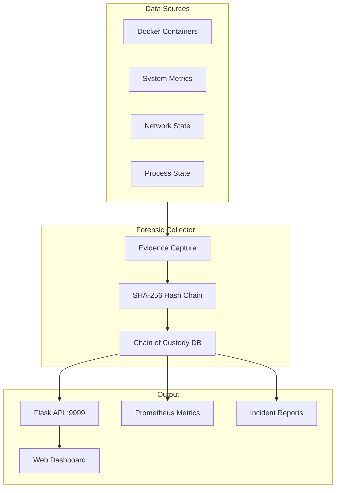

# Forensic Evidence Collector

Production compliance automation platform with tamper-evident audit trails and real-time evidence collection.

[](https://python.org/)
[](https://docker.com/)
[](https://prometheus.io/)
[](https://sqlite.org/)

---

## Overview

Forensic-grade evidence collection system that captures system state, container forensics, and compliance metrics with cryptographic chain of custody. Designed for regulated industries requiring audit-ready documentation.

**Live Dashboard:** [dashboards.jagdevops.co.za](https://dashboards.jagdevops.co.za)

---

## Architecture


```mermaid
flowchart TB
    subgraph Sources["Data Sources"]
        DOCKER["Docker Containers"]
        SYSTEM["System Metrics"]
        NETWORK["Network State"]
        PROCESS["Process State"]
    end

    subgraph Collector["Forensic Collector"]
        CAPTURE["Evidence Capture"]
        HASH["SHA-256 Hash Chain"]
        DB["Chain of Custody DB"]
    end

    subgraph Output["Output"]
        API["Flask API :9999"]
        METRICS["Prometheus Metrics"]
        REPORTS["Incident Reports"]
        DASH["Web Dashboard"]
    end

    Sources --> CAPTURE
    CAPTURE --> HASH
    HASH --> DB
    DB --> API & METRICS & REPORTS
    API --> DASH
```

---

## Key Features

### Tamper-Evident Hash Chain
Each evidence block links to the previous via SHA-256 hash, creating an immutable audit trail.

```python
block = {
    'evidence_id': 'uuid',
    'timestamp': '2025-05-28T12:00:00',
    'event_type': 'incident_capture',
    'data': {...},
    'previous_hash': 'abc123...',
    'hash': 'def456...'  # SHA-256 of block content
}
```

### Multi-Framework Compliance
| Framework | Coverage |
|-----------|----------|
| **FDA 21 CFR Part 11** | Electronic signatures, audit trails, data integrity |
| **SOX** | Financial controls, change management, segregation of duties |
| **PCI-DSS** | Data encryption, access logging, vulnerability scanning |
| **GMP** | Temperature control, batch tracking, equipment calibration |

### Real-Time Evidence Collection
- **Container Forensics**: Status, restarts, exit codes, mounts
- **System State**: CPU, memory, disk, load average, network I/O
- **Network Connections**: Active connections, ports, PIDs
- **Process Analysis**: Top memory/CPU consumers

---

## Technical Stack

| Component | Technology |
|-----------|------------|
| **Language** | Python 3.11 |
| **API** | Flask |
| **Metrics** | Prometheus Client |
| **Container** | Docker |
| **Database** | SQLite (chain of custody) |
| **System Monitoring** | psutil |

---

## API Endpoints

| Endpoint | Method | Description |
|----------|--------|-------------|
| `/health` | GET | Health check |
| `/metrics` | GET | Prometheus metrics |
| `/chain` | GET | Evidence chain status |
| `/forensic/chain/<sample_id>` | GET | Sample chain of custody |
| `/forensic/compliance/live` | GET | Real-time compliance scores |
| `/forensic/evidence/<hash>` | GET | Retrieve evidence by hash |
| `/forensic/audit/<date>` | GET | Audit trail for date |

---

## Prometheus Metrics

```promql
# Compliance scores by framework
compliance_score{standard="FDA"}
compliance_score{standard="SOX"}
compliance_score{standard="GMP"}

# Evidence chain metrics
chain_blocks                    # Total evidence blocks
evidence_verifications_total    # Verification attempts
anomalies_detected_total        # Detected anomalies
data_integrity_score            # Chain integrity percentage
```

---

## Deployment

### Docker

```bash
# Build
docker build -t forensic-collector -f docker/Dockerfile.forensic .

# Run
docker run -d \
  --name forensic-collector \
  -p 9999:9999 \
  -v /var/run/docker.sock:/var/run/docker.sock \
  -v forensic-data:/data \
  forensic-collector
```

### Environment Variables

| Variable | Default | Description |
|----------|---------|-------------|
| `LOKI_URL` | `http://localhost:3100` | Loki log aggregator |
| `PROMETHEUS_URL` | `http://localhost:9090` | Prometheus server |

---

## Usage

```bash
# Run as metrics server
python forensic_collector.py server

# Capture incident manually
python forensic_collector.py capture COMPLIANCE_VIOLATION "FDA audit finding"

# Verify evidence integrity
python forensic_collector.py verify INC-20250528-120000

# List recent incidents
python forensic_collector.py list

# Test connections
python forensic_collector.py test-loki
python forensic_collector.py test-prometheus
```

---

## Evidence Verification

```bash
$ python forensic_collector.py verify INC-20250528-120000
Verification: Evidence integrity verified - admissible for audit
```

If tampered:
```bash
Verification: WARNING: Evidence has been modified - NOT admissible!
```

---

## Sample Output

### Incident Report
```
================================================================================
                        FORENSIC INCIDENT REPORT
================================================================================

INCIDENT IDENTIFICATION
-----------------------
Incident ID: INC-20250528-120000
Timestamp: 2025-05-28T12:00:00
Type: COMPLIANCE_VIOLATION
Description: FDA audit finding

SYSTEM STATE AT INCIDENT
------------------------
CPU Usage: 45%
Memory Used: 72%
Disk Used: 58%

CONTAINER FORENSICS
-------------------
Total Containers: 12
Running: 10
Stopped: 1
Failed: 1

FORENSIC CHAIN OF CUSTODY
-------------------------
Evidence has been preserved with cryptographic integrity protection.
This report is admissible for compliance audits and legal proceedings.
================================================================================
```

---

## Project Structure

```
digital-evidence-pipeline/
├── scripts/
│   ├── forensic_collector.py   # Main collector with hash chain
│   ├── forensic_api.py         # Flask API server
│   └── storage_backend.py      # Persistent storage
├── docker/
│   ├── Dockerfile.forensic     # Container build
│   ├── docker-compose.yml      # Full stack deployment
│   └── prometheus.yml          # Metrics config
├── dashboards/
│   ├── executive-compliance.json
│   └── technical-metrics.json
└── README.md
```

---

## From Forensics to DevOps

This project demonstrates the translation of forensic investigation skills to DevOps:

| Forensic Skill | DevOps Application |
|----------------|-------------------|
| Evidence Collection | Automated audit trails |
| Chain of Custody | Cryptographic hash chains |
| Investigation Reports | Compliance dashboards |
| Quality Assurance | Automated validation |

---

## Author

**Jaime Gabriels** — DevOps Engineer

[](https://jagdevops.co.za)
[](https://linkedin.com/in/jaime-gabriels-643132386)
[](https://github.com/GABRIELS562)
